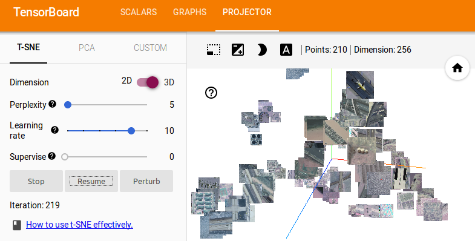

# patchwork


### Interactive Machine Learning for an Imperfect World

This project is an experiment on how to leverage machine learning when the problem is poorly-specified. I'm interested in cases where we may not know *exactly* what we're looking for when we start the problem, but expect that starting to systematically sort through data would help us refine our question. In particular, we want a system for sorting through images that can handle:

* a set of classes that may be revised mid-project and may not be mutually disjoint (current approach: represent labels using multi-hot encoding)
* severe imbalances in one or more classes as well as in which classes are labeled (current approach: build training batches using stratified sampling)
* a relatively small number of labels (current approach: frozen feature extractor trained with self-supervised learning, active learning for motivating new images to label, few-shot models, semi-supervised loss function)
* partially-missing labels (current approach: masked multi-hot loss funtion)
* images whose properties may not be clear to the user(current approach: an option to exclude images during labeling)

If you're going to try this code out- I apologize in advance for the state of the GUI; I'm not really an interface guy.

Right now, 

* Labels are stored in a `pandas.DataFrame`
* The feature extractor and fine-tuning networks are `keras.Model` objects
* The interface is built with `panel`


`patchwork` has been tested with `tensorflow` 1.13.

* Free software: MIT license

## Installation

## Active Learning GUI

To start with you'll need:

* A list of paths to all your image files
* The number of channels for each image
* A size to rescale all images to
* An initial (or revised) set of classes

## Label DataFrame

Labels are stored in a `pandas.DataFrame` containing:

* a `filepath` column containing the path to each image
* an `exclude` column (default `False`) indicating images to be excluded from the training set
* one column for each category with values `None`, `0`, or `1` (default `None`) indicating whether that image has that label (and if so, whether the class is present)

## Building Feature Extractors

The `patchwork.feature` module has several models implemented for unsupervised or self-supervised representation learning:

* Context Encoders
* DeepCluster
* Invariant Information Clustering

The module has a class to manage the training of each model. You can initialize the trainer with a fully-convolutional `keras` model for it to train (otherwise it will use a default model).

In addition to each model's training hyperparameters, the different feature extractor trainers share input pipeline and augmentation parameters.

### Configuring feature extractor trainers

#### Input parameters

* `imshape` (H,W) tuple defining an image shape. All images will be resampled to this shape.
* `num_channels` integer; the number of channels per image. If an image has more channels than this (for example, and RGBA image when `num_channels=3`) it will be truncated.
* `norm` value to divide image data by to scale it to the unit interval. This will usually be 255 but may be different for GeoTIFFs, for example.
* `batch_size` integer; batch size for training
* `num_parallel_calls` integer; number of parallel threads to use for loading and augmenting (generally set to number of CPUs)
* `sobel` Boolean; if `True` then each image is averaged across its channels and then Sobel filtered. The 2-channel output of the Sobel filter is padded with a third channel of zeros so that you can use this with standard 3-channel-input convnets.
* `single_channel` Boolean; let `patchwork` know that you expect single-channel input images. If `num_channels > 1` the image will be repeated across channels (again, for example, for using single-channel images with 3-channel-input convnets)

#### Augmentation parameters

You can pass `False` to the `augment` parameter to disable augmentation, `True` to use defaults, or a dictionary containing any of the following (with the rest disabled):


* `max_brightness_delta` (default 0.2): randomly adjust brightness within this range
* `contrast_min` (default 0.4) and `contrast_max` (default 1.4): randomly adjust contrast within this range
* `max_hue_delta` (default 0.1): randomly adjust hue within this range
* `max_saturation_delta` (default 0.5): randomly adjust saturation within this range
* `left_right_flip` (default True): if True, flip images left-to-right 50% of the time
* `up_down_flip` (default True): if True, flip images top-to-bottom 50% of the time
* `rot90` (default True): if True, rotate images 0, 90, 180, or 270 degrees with equal probability
* `zoom_scale` (default 0.3): add a random pad to each side of the image, then randomly crop from each side- this parameter sets the scale for both.
* `select_prob` (default 0.5) flip a weighted coin with this probability for each of the augmentation steps to decide whether to apply it.


### Context Encoder

The main thing this implementation is missing from the inpainting setup in Pathak et al's paper is the amplified loss function in the border region between masked and unmasked areas.

```{python}
import tensorflow as tf
import patchwork
tf.enable_eager_execution()


# load paths to train and test files
trainfiles = [x.strip() for x in open("mytrainfiles.txt").readlines()]
testfiles = [x.strip() for x in open("mytestfiles.txt").readlines()]

# call training function (it will initialize models if none provided)
encoder, inpainter, discriminator = patchwork.feature.train_context_encoder(trainfiles,
                                        testfiles=testfiles,
                                        num_epochs=1000,
                                        logdir="logs/",
                                        batch_size=64,
                                        num_parallel_jobs=6)
```

Tensorboard logs will be stored for the loss function on `testfiles` as well as visualization on inpainting:


### DeepCluster


```{python}
import tensorflow as tf
import patchwork

# load paths to train files
trainfiles = [x.strip() for x in open("mytrainfiles.txt").readlines()]

# initialize a feature extractor
fcn = patchwork.feature.BNAlexNetFCN()

# train
fcn = patchwork.feature.train_deepcluster(trainfiles, fcn, 
                                            "logs_deepclust/",
                                            epochs=50,
                                             num_parallel_calls=6,
                                             pca_dim=64,
                                             k=100)
```

### Visualizing learned features
         

**The tensorboard projector doesn't appear to be functioning in TF2.0.**
(not yet fully tested) a quick macro for throwing a couple hundred image embeddings into the tensorboard projector:

```{python}
import tensorflow as tf
import patchwork

# load a note-huge set of images to test
testfiles = [x.strip() for x in open("mytestfiles.txt").readlines()]
# load your saved feature extractor                                            
fcn = tf.keras.models.load_model("deepcluster_ucmerced_BNAlexNetFCN.h5")                                        
patchwork.viz.build_tensorboard_projections(fcn, testfiles, "embed_logs/")
```
                                            

                                        
## Interactive Labeling and Fine-Tuning

More details forthcoming. Here are the basic steps to load the GUI inside a Jupyter notebook:

```{python}
import matplotlib.pyplot as plt
import panel as pn
pn.extension()
plt.ioff()

# prepare a DataFrame to hold labels if this is a new project (or
# just load the old DataFrame otherwise)
imfiles = [x.strip() for x in open("allmyfiles.txt").readlines()]                                     
classes = ["cat", "mammal", "dog"]
df = patchwork.prep_label_dataframe(imfiles, classes)

# load a feature extractor
fe = tf.keras.models.load_model("pretrained_feature_extractor.h5")
fe.trainable = False

# pass dataframe and feature extractor to a Patchwork object and
# load the GUI
pw = patchwork.Patchwork(df, feature_extractor=fe, imshape=(256,256), 
                        outfile="saved_labels.csv")
pw.panel()
```
                                        

## Credits

This package was created with Cookiecutter_ and the `audreyr/cookiecutter-pypackage`_ project template.

.. _Cookiecutter: https://github.com/audreyr/cookiecutter
.. _`audreyr/cookiecutter-pypackage`: https://github.com/audreyr/cookiecutter-pypackage
