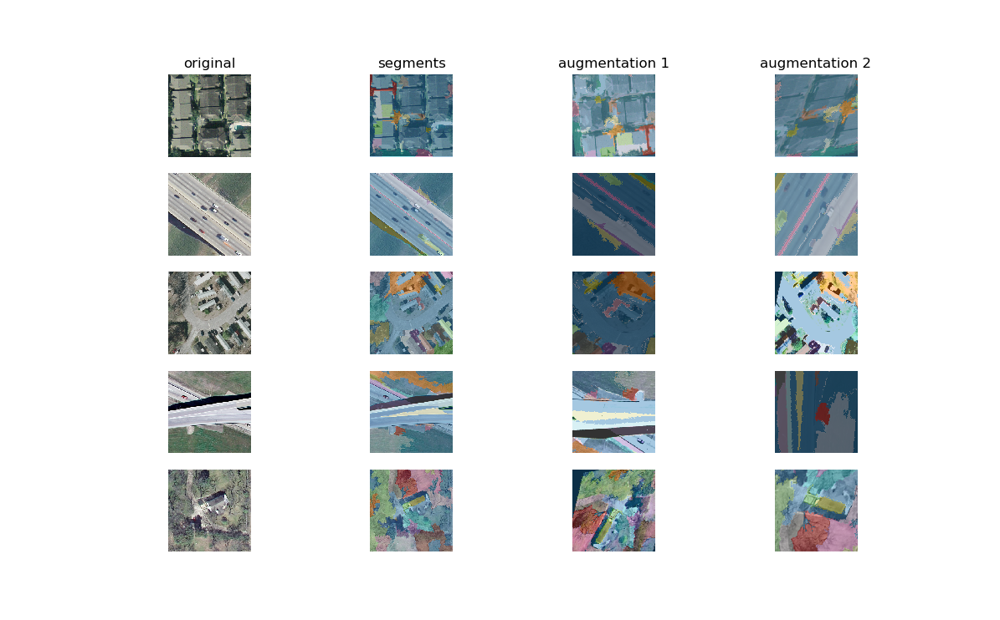

# Feature Extractor trainers

The `patchwork.feature` module has several models implemented for unsupervised or self-supervised representation learning:

* [Context Encoders](https://arxiv.org/abs/1604.07379)
* [DeepCluster](https://arxiv.org/abs/1807.05520)
* [SimCLR](https://arxiv.org/abs/2002.05709) (along with multi-GPU version)
* [MoCo](https://arxiv.org/abs/1911.05722), including several variants:
  * nonlinear projection head from [MocoV2](https://arxiv.org/abs/2003.04297)
  * option to modify noise-contrastive loss function using margin term from [EqCo](https://arxiv.org/abs/2010.01929)
  * option to generate synthetic hard examples on-the-fly using [MoCHi](https://arxiv.org/abs/2010.01028)
* [HCL](https://arxiv.org/abs/2010.04592) (along with multi-GPU implementation)
* [DetCon](https://arxiv.org/abs/2103.10957) (multi-GPU implementation)

The module has a class to manage the training of each model. The trainers are meant to be as similar as possible, to make it easy to throw different self-supervision approches at your problem and see how they compare. Here's what they have in common:

### Building

* Each feature extractor training class shares common [input pipeline and augmentation parameters](input_aug.md).
* Choose between `adam` and `momentum` optimizers, with no learning rate decay, or `exponential` (smooth exponential decay), `staircase` (LR cut in half every `lr_decay` steps), or `cosine` decay.
* Call `trainer.load_weights()` to import weights of all the training components from a previous run
* Each is initialized with a fully-convolutional `tf.keras.Model` object (some come with a default model)

### Benchmarking

* Input a list of paths to test files to compute out-of-sample metrics and visualizations for TensorBoard
  * For context encoders, this can help you tell when you're just memorizing your dataset
  * For contrastive learning methods, [alignment and uniformity](https://arxiv.org/abs/2005.10242) measures are computed automatically
* If you have a small number of labels for a downstream task, the trainer will automate the linear downstream task test that self-supervision papers use for comparison:
  * Input labels as a dictionary mapping filepaths to labels
  * At the end of each epoch (or whenever `trainer.evaluate()` is called), `patchwork` will do a train/test split on your labels (the split is deterministic to make sure it's consistent across runs), compute features using flattened outputs of the FCN, and train a linear support vector classifier on the features. The test accuracy and confusion matrix are recorded for TensorBoard.
* If you can't get any labels together, call `trainer.rotation_classification_test()` to apply the proxy method from Reed *et al*'s [Evaluating Self-Supervised Pretraining Without Using Labels](https://arxiv.org/abs/2009.07724).
  
### Interpreting

* All hyperparameters are automatically logged to the [TensorBoard HPARAMS](https://www.tensorflow.org/tensorboard/hyperparameter_tuning_with_hparams) interface, so you can visualize how they correlate with the downstream task accuracy, rotation task accuracy, alignment, or uniformity.
* The `trainer.save_projections()` method will record embeddings, as well as image sprites and metadata for the [TensorBoard projector](https://www.tensorflow.org/tensorboard/tensorboard_projector_plugin). I've sometimes found this to be a helpful diagnostic tool when I'm *really* stuck.
* The `trainer.visualize_kernels()` method will record to TensorBoard an image of the kernels from the first convolutional layer in your network. If those kernels don't include a few that look like generic edge detectors, something has probably gone horribly wrong (e.g. you're learning a shortcut somewhere). Example of a bad case below.
* If you're using a dictionary of labeled examples, you can also set the `query_fig` kwarg to `trainer.fit()` or `trainer.evaluate()` and it will record a TensorBoard image that shows one image from each class, as well as the images with most (cosine) similar embeddings. I've occasionally found this kind of visualization useful for diagnosing shortcuts that the model is learning. 

#### Hyperparameter visualization


#### Projector embeddings


#### Filters from first convolutional layer


### Documenting

* All hyperparameters are automatically recorded to a YAML file in the log directory
* Call `trainer.track_with_mlflow()` before you begin training, to use the [MLflow tracking API](https://mlflow.org/docs/latest/tracking.html) to log parameters and metrics.
* Pass a string containing any contextual information about the experiment to the `notes` kwarg; it will be added to the YAML file (and recorded for MLflow)
  


#### A word on batch normalization

There's a running theme in contrastive learning literature of results depending critically on how batch normalization is used in the projection head (such as MoCo requiring batchnorm shuffling across GPUs, or BYOL collapsing when batchnorm is removed). In my (limited) test cases it seems like batchnorm in the projection head can sometimes cause problems, particularly in situations where you're hardware-limited to smaller batch sizes.

For this reason- there's a Boolean `batchnorm` kwarg in several of the trainers that you can use to disable batch normalization in the hidden layer of the projection head. I'd recommend trying this out if you find yourself in either of these situations:

* The contrastive training loss plateaus early on in training
* The loss is decreasing but the downstream accuracy never goes above the base rate


Click [here](ucmerced.md) for an example comparing these methods on the UCMerced Land Use dataset.

# Self-supervised models in `patchwork.feature`

## Context Encoder

The `patchwork.feature` module contains an implementation of the algorithm in Deepak Pathak *et al*'s [Context Encoders: Feature Learning by Inpainting](https://arxiv.org/abs/1604.07379). 

The trainer can input a list of test files- a small out-of-sample dataset is handy for visualizing how well the inpainter can reconstruct images (as opposed to just memorizing your data).

### Differences between the paper and `patchwork`

My implementation is missing the amplified loss function in the border region between masked and unmasked areas.

### Example code

```{python}
import tensorflow as tf
import patchwork as pw
import json

# load paths to train and test files
trainfiles = [x.strip() for x in open("mytrainfiles.txt").readlines()]
testfiles = [x.strip() for x in open("mytestfiles.txt").readlines()]
labeldict = json.load(open("dictionary_mapping_some_images_to_labels.json"))

# pick a place to save models and tensorboard logs
log_dir = "/path/to/my/log_dir/"

# initialize trainer and train
trainer = pw.feature.ContextEncoderTrainer(
    log_dir,
    trainfiles,
    testdata=testfiles,
    num_parallel_calls=6,
    augment=aug_params,
    lr=1e-3,
    batch_size=32,
    imshape=(255,255),
    downstream_labels=labeldict
)
```

Tensorboard logs will be stored for the loss function on `testfiles` as well as visualization on inpainting:


### Some notes on using Context Encoders

* CE can overfit easily on small datasets (and increasing the noise added by augmentation can help considerably). Reserving a small out-of-sample dataset to measure reconstruction loss on can help you identify when this is happening.


## DeepCluster

`patchwork` contains a TensorFlow implementation of the algorithm in Mathilde Caron *et al*'s [Deep Clustering for Unsupervised Learning of Visual Features](https://arxiv.org/abs/1807.05520).

### Differences between the paper and `patchwork`

I tried to keep the parameters as similar to the paper as possible. One additional keyword argument is `mult` (integer, default 1). Caron *et al* refit the k-means algorithm once per epoch on Imagenet (with `batch_size=256` this works out to roughly 5000 steps between refitting the pseudolabels). If you're working on a significantly smaller dataset you may need to run through it multiple times before refitting; set `mult=N` to refit once every `N` epochs.

### Example code

```{python}
import tensorflow as tf
import patchwork as pw

# load paths to train files
trainfiles = [x.strip() for x in open("mytrainfiles.txt").readlines()]
labeldict = json.load(open("dictionary_mapping_some_images_to_labels.json"))

# initialize a feature extractor
fcn = patchwork.feature.BNAlexNetFCN()

# pick a place to save models and tensorboard logs
log_dir = "/path/to/my/log_dir/"

# train
dctrainer = pw.feature.DeepClusterTrainer(
        log_dir,
        fcn=fcn,
        trainingdata=trainfiles,
        augment=True, # or pass a dict of aug parameters here
        pca_dim=256
        k=250,
        dense=[1024, 1024],
        lr=1e-3,
        lr_decay=100000,
        batch_size=64,
        num_parallel_calls=6,
        downstream_labels=labeldict
    )

dctrainer.fit(10)
```

### Some notes on using DeepCluster

* I notice much faster training when I transfer learn from a network pretrained on ImageNet than with random weights (within 10 epochs rather than hundreds on UCMerced, for example)
* Transfer learning from a network pretrained with DeepCluster, using different parameters, can give weird results.
        

## SimCLR

*Note: this trainer is redundant with the `HCLTrainer` so I plan on deprecating it.*

`patchwork` contains a TensorFlow implementation of the algorithm in Chen *et al*'s [A Simple Framework for Contrastive Learning of Visual Representations](https://arxiv.org/abs/2002.05709). 

### Differences between the paper and `patchwork`

I haven't implemented the LARS optimizer used in the paper. Using the `opt_type` kwarg you can choose Adam or momentum optimizers.

### Example code
   
```{python}
import tensorflow as tf
import patchwork as pw

# load paths to train files
trainfiles = [x.strip() for x in open("mytrainfiles.txt").readlines()]
labeldict = json.load(open("dictionary_mapping_some_images_to_labels.json"))

# initialize a feature extractor
fcn = tf.keras.applications.ResNet50V2(weights=None, include_top=False)

# choose augmentation parameters
aug_params = {'gaussian_blur': 0.25,
             'drop_color': 0.2,
             'gaussian_noise': 0.2,
             'sobel_prob': 0.15,
             'brightness_delta': 0.2,
             'contrast_delta': 0.4,
             'saturation_delta': 0.1,
             'hue_delta': 0.1,
             'flip_left_right': True,
             'flip_up_down': True,
             'rot90': True,
             'zoom_scale': 0.4,
             'mask': 0.25}
# generally a good idea to visualize what your augmentation is doing
pw.viz.augplot(trainfiles, aug_params)   

# pick a place to save models and tensorboard logs
log_dir = "/path/to/my/log_dir/"

# train
trainer = pw.feature.SimCLRTrainer(
    logdir,
    trainfiles,
    testdata=testfiles,
    fcn=fcn,
    num_parallel_calls=6,
    augment=aug_params,
    lr=1e-4,
    lr_decay=0,
    temperature=0.1,
    num_hidden=128,
    output_dim=32,
    batch_size=32,
    imshape=(256,256),
    downstream_labels=downstream_labels
)

trainer.fit(10)
```

### Some notes on using SimCLR


Note that SimCLR is much more critically dependent on image augmentation for its learning than Context Encoders or DeepCluster, so it's worth the time to experiment to find a good set of augmentation parameters. My experience so far is that SimCLR benefits from more aggressive augmentation than you'd use for supervised learning.
     
    
## Distributed Training

**Update:** don't do distributed training with this trainer. It does not give the full benefit of larger batches for SimCLR (e.g. increased number of negative examples) because each replica only compares against negative examples from within that replica. Use `HCLTrainer` to train SimCLR on a multi-GPU system.
    
              
## Momentum Contrast

If the hardware you're using doesn't have enough memory for the giant batch sizes that SimCLR prefers, He *et al*'s [Momentum Contrast for Unsupervised Visual Representation Learning](https://arxiv.org/abs/1911.05722) may give better results, as it decouples the number of contrastive comparisons from the batch size.

### Differences between the paper and `patchwork`

The MoCo paper has some discussion on how batch normalization can cause their algorithm to learn a shortcut; their solution is to shuffle embeddings across GPUs for comparison (and then shuffling back after).

The `patchwork` implementation attempts to accomplish the same effect while requiring only one GPU- each batch is divided in half, the halves passed through the network, and then projected representations are reassembled before computing the contrastive loss. The division used for the key network is different from the division used for the query network, so that each direct comparison between augmented images is sampled from different batch statistics.

I have not yet implemented distributed training for MoCo.

### Example code


```{python}
import tensorflow as tf
import patchwork as pw

# load paths to train files
trainfiles = [x.strip() for x in open("mytrainfiles.txt").readlines()]
labeldict = json.load(open("dictionary_mapping_some_images_to_labels.json"))

# initialize a feature extractor
fcn = tf.keras.applications.ResNet50V2(weights=None, include_top=False)

# choose augmentation parameters
aug_params = {'jitter':1,
             'gaussian_blur': 0.25,
             'flip_left_right': True,
             'zoom_scale': 0.1,}
# generally a good idea to visualize what your augmentation is doing
pw.viz.augplot(trainfiles, aug_params)   

# pick a place to save models and tensorboard logs
log_dir = "/path/to/my/log_dir/"

# train
trainer = pw.feature..MomentumContrastTrainer(
        log_dir,
        trainfiles,
        fcn=fcn,
        num_parallel_calls=6,
        augment=aug_params,
        lr=3e-2,
        weight_decay=1e-4,
        decay_type="staircase",
        lr_decay=10000,
        alpha=0.999,
        tau=0.07,
        batches_in_buffer=50,
        num_hidden=512,
        output_dim=64, 
        batch_size=128,
        imshape=(128,128),
        downstream_labels=labeldict
    )

trainer.fit(10)
```


   
## HCL

**This trainer requires TensorFlow >= 2.4**

The paper [Contrastive Learning with Hard Negative Samples](https://arxiv.org/abs/2010.04592) modifies SimCLR to better-handle negative examples by attempting to suppress both trivial negatives and false negatives. Their paper reports results on smaller batch sizes than the SimCLR paper, which is great for those of us not working on TPUs. It definitely benefits from bigger batches, however.

### Differences between the paper and `patchwork`

So far I think this one is pretty close to the paper and Robinson *et al*'s [PyTorch code](https://github.com/joshr17/HCL).

### SimCLR is a special case of HCL

The two methods are identical when `beta = 0` and `tau_plus = 0`. My plan is to deprecate the `SimCLRTrainer`.

### Example code


```{python}
import tensorflow as tf
import patchwork as pw

# load paths to train files
trainfiles = [x.strip() for x in open("mytrainfiles.txt").readlines()]
labeldict = json.load(open("dictionary_mapping_some_images_to_labels.json"))

# initialize a feature extractor
fcn = tf.keras.applications.ResNet50(weights=None, include_top=False)

# choose augmentation parameters
aug_params = {'jitter':1,
             'gaussian_blur': 0.25,
             'flip_left_right': True,
             'zoom_scale': 0.1,}
# generally a good idea to visualize what your augmentation is doing
pw.viz.augplot(trainfiles, aug_params)   

# pick a place to save models and tensorboard logs
log_dir = "/path/to/my/log_dir/"

# train
trainer = pw.feature.HCLTrainer(
        log_dir,
        trainfiles,
        testdata=testfiles,
        fcn=fcn,
        num_parallel_calls=6,
        augment=aug_params,
        opt_type="adam",
        lr=1e-3,
        lr_decay=0,
        weight_decay=1e-6,
        num_hidden=128,
        output_dim=64,
        temperature=0.1,
        beta=0.5,
        tau_plus=0.1,
        batch_size=128, 
        imshape=(128,128),
        downstream_labels=labeldict
    )

trainer.fit(10)
```


## Distributed Training

The `HCLTrainer` always wraps the pieces in a `tf.distribute.Strategy` object, using the default strategy if none is passed to the trainer. The changes to your workflow are pretty minimal:

1. Initialize a "strategy" object from `tf.distribute`
* Define or load your base feature extractor within `strategy.scope()`
* Pass the strategy object to the Trainer object

Everything else should work the same. The batch size specified is the **global** batch size. I've only tested with the `MirroredStrategy()` and `OneDeviceStrategy()` so far. 

During training, after embeddings are computed on each GPU's subset of the batch, those embeddings are gathered so that each GPU's subset can contrast with negative samples from the others. This uses `ReplicaContext.all_gather()` which requires TensorFlow 2.4.

```
# same basic setup as before, but....

strat = tf.distribute.MirroredStrategy()

# check this- it should return the number of GPUs if it's working correctly
assert strat.num_replicas_in_sync == number_of_gpus_i_was_expecting

with strat.scope():
    # initialize a new model
    fcn = tf.keras.applications.ResNet50(weights=None, include_top=False)
    # or transfer learn from your last one or pretrained weights
    fcn.load_weights("my_previous_model.h5")


# pick a place to save models and tensorboard logs
log_dir = "/path/to/my/log_dir/"

# train
trainer = pw.feature.HCLTrainer(
        log_dir,
        trainfiles,
        testdata=testfiles,
        fcn=fcn,
        num_parallel_calls=6,
        augment=aug_params,
        opt_type="adam",
        lr=1e-3,
        lr_decay=0,
        weight_decay=1e-6,
        num_hidden=128,
        output_dim=64,
        temperature=0.1,
        beta=0.5,
        tau_plus=0.1,
        batch_size=128, # THIS IS THE GLOBAL BATCH SIZE!
        imshape=(128,128),
        downstream_labels=labeldict,
        strategy=strat
    )

trainer.fit(10)
```
    
    
    

   
## DetCon

**This trainer requires TensorFlow >= 2.4**

[Efficient Visual Pretraining with Contrastive Detection](https://arxiv.org/abs/2103.10957) is another modification to SimCLR (or BYOL)- this time, breaking up each image using a heuristic segmentation so that features can be contrasted within images in addition to between them. My implementation of DetCon_S works just like the HCLTrainer, but with two additional hyperparameters:

* `mean_scale` sets the average scale and minimum size for the Felzenszwalb segmentation algorithm. To add some randomness to the segmentation, the value used is uniformly sampled between half this scale and 1.5x this scale. Setting `mean_scale=0` will use a square grid instead (like the "spatial heuristic" in figure 3 of the DetCon paper). This is cheaper to compute but probably not as effective.
* `num_samples` sets the number of segments to sample per image- so the effective batch size for SimCLR loss will be `num_samples x batch_size`. The sampling is biased toward larger segments. If using `mean_scale=0`, this should be a square number (e.g. `mean_scale=9` would be a 3x3 grid).

### Some practical issues with dynamically generating segments

When contrasting segment-weighted feature vectors, there are a couple cases we need to handle:

* The Felzenszwalb segmentation might find fewer segments than `num_samples`. In this case my code will switch to sampling segments with replacement.
* The coupled image/segmentation augmentation step might completely remove one segment from the image (say, by cropping it out). Positive comparisons involving segments that have been augmented out of the image view are masked out of the loss function.

Finding the best hyperparameters will mean tuning `mean_scale` and `num_samples` *as well as* the augmentation parameters (specifically `zoom_scale` and `shear`) together to find some balance between getting the right segments, having strong enough augmentation, and not wasting too much computation. To help, I've added an input pipeline tool at `pw.viz.detcon_input_pipeline()` that will run your configuration on a set of images and report how often it had to sample with replacement, how many examples it had to discard, and visualize 5 pairs of augmented images with their respective segmentation masks.

```
trainfiles = [imdir+x for x in os.listdir(imdir)]

aug = {'flip_left_right': True,
 'flip_up_down': True,
 'rot90': True,
 'zoom_scale': 0.4,
 'jitter': 1.0,
 'shear': 0.3}
 
pw.viz.detcon_input_pipeline(trainfiles[:200], aug, mean_scale=200, 
                                num_samples=10, imshape=(256,256)) 
```



### Differences between the paper and `patchwork`

I've included the HCL hyperparameters as well. As of the time I'm writing this DeepMind hasn't released their code yet, so there may be other differences if I've misinterpreted anything from their paper.

### Example code


```{python}
import tensorflow as tf
import patchwork as pw

# load paths to train files
trainfiles = [x.strip() for x in open("mytrainfiles.txt").readlines()]
labeldict = json.load(open("dictionary_mapping_some_images_to_labels.json"))

strat = tf.distribute.MirroredStrategy()
with strat.scope():
    # initialize a new model
    fcn = tf.keras.applications.ResNet50(weights=None, include_top=False)
    # or transfer learn from your last one or pretrained weights
    fcn.load_weights("my_previous_model.h5")

# initialize a feature extractor
fcn = tf.keras.applications.ResNet50(weights=None, include_top=False)

# choose augmentation parameters
aug_params = {'jitter':1,
             'gaussian_blur': 0.25,
             'flip_left_right': True,
             'zoom_scale': 0.1,}
             
# pick a place to save models and tensorboard logs
log_dir = "/path/to/my/log_dir/"

# train
trainer = pw.feature.DetConTrainer(
        log_dir,
        trainfiles,
        testdata=testfiles,
        fcn=fcn,
        num_parallel_calls=6,
        augment=aug_params,
        lr=1e-3,
        weight_decay=1e-6,
        num_hidden=128,
        output_dim=64,
        temperature=0.1,
        mean_scale=200,
        num_samples=5,
        batch_size=128, 
        imshape=(128,128),
        downstream_labels=labeldict,
        strategy=strat
    )

trainer.fit(10)
```