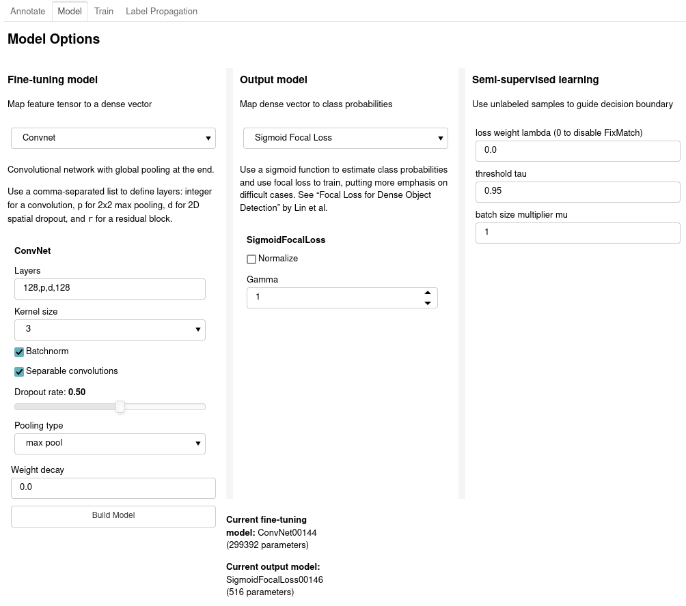

# Active Learning GUI

Here's the intended workflow:

* Start with a list of paths to all your image files
* Train a feature extractor for the images (as a `keras` model), or generate pre-extracted features (as a `numpy` array) for each image.
  * In the pre-extracted feature case, the rest of the workflow is lightweight enough that I can run it on an old laptop with no GPU
* Use `patchwork.prep_label_dataframe()` to initialize a `pandas` dataframe to store your labels (or start with an existing one). Since your time is precious, a careful representation of the time you spend annotating is the most important resource we'll build. The dataframe will have a few columns:
  * path to the file
  * a Boolean `validation` column (default `False`) that indicates the image should be used for testing any models we build and held out of training
  * a Boolean `exclude` column (default `False`) that records problematic images- record that you've seen it so you can find it again, but remove it from the training set.
  * one column per class that can take values `None` (unlabeled), `0` (doesn't contain class) or `1` (contains class). `patchwork` can handle partially-missing labels.
* Using your features and label dataframe, start a `patchwork.GUI` object.
  * Sample images to label
  * Select a fine-tuning model (maps generic feature tensors to task-specific feature vector) and output model (maps feature vector to probabilities over classes)
  * Train model and evaluate results
  * Lather, rinse, and repeat: use active learning to prioritize which images to label, and add capacity to your fine-tuning model as needed.
* When you've built a useful prototype, access the labels in `GUI.df` or the models in `GUI.models` to connect to the next step in whatever problem you're solving!

     
For a sober perspective on the pragmatic issues making active learning difficult, I recommend checking out Lowell *et al*'s [Practical Obstacles to Deploying Active Learning](https://arxiv.org/abs/1807.04801).
                                        
## Getting started

Here are the basic steps to load the GUI inside a Jupyter notebook:

```{python}
import matplotlib.pyplot as plt
import panel as pn
pn.extension()
plt.ioff()

# prepare a DataFrame to hold labels if this is a new project (or
# just load the old DataFrame otherwise)
imfiles = [x.strip() for x in open("allmyfiles.txt").readlines()]                                     
classes = ["cat", "mammal", "dog"]
df = patchwork.prep_label_dataframe(imfiles, classes)

# load a feature extractor
fe = tf.keras.models.load_model("pretrained_feature_extractor.h5")

# pass dataframe and feature extractor to a Patchwork object and
# load the GUI
gui = patchwork.GUI(df, feature_extractor=fe, imshape=(256,256), 
                        outfile="saved_labels.csv")
gui.panel()
```

You don't have to run inside Jupyter- check the [panel docs](https://panel.holoviz.org/user_guide/Deploy_and_Export.html) for instructions on how to deploy or embed the app elsewhere.

## Label tab

The Label tab is there you can annotate images. It has two main parts- a sampling tool and a labeling tool.

### Sampling tool

Choose how to sample the next set of images- choose which subset of images to sample from (unlabeled, partially labeled, images containing a particular label, etc) and how to prioritize them. You'll probably sample differently as you build your dataset:

* For initial tagging- sort by `random`
* For active learning by uncertainty sampling- sort by `max entropy`
* For uncertainty sampling with respect to a particular class- sort by `maxent <class name>`
* For hard negative mining- sort by `high <class name>`
* For [BADGE sampling](https://arxiv.org/abs/1906.03671), sort by `BADGE`. For this to work, you need to select the "Update BADGE gradients?" option while training.


#### Notes on BADGE

* This is new so I'm still experimenting with it! The paper is a really clever approach to the difficult problem of Active Learning.
* The gradient embeddings are computed after training and stored in memory- so be careful with the model you use for it. If you have `N` images in your dataset, a feature space with dimension `d` and `C` multihot categories, the gradient vectors will be computed as a  `(N,dC)` matrix.
  * If memory is a constraint, use a lower-dimension feature extractor or a fine-tuning model with a lower output dimension


### Labeling tool

Use the arrows to adjust which of the sampled images is selected. For each, you can choose:

* Whether to exclude it (not used in training or validation- use this for problematic examples)
* Whether to reserve it as part of a validation set (not used in training but used for out-of-sample tests)
* Whether it contains any combinations of your classes

Every time you hit the arrow buttons or the `sample` button the annotations are recorded in your label dataframe. Below the buttons is a table collecting the total number of annotations for each category in each dataset.


## Model tab

Once you've got some images labeled, design a model.

* **Fine-tuning model:** inputs feature tensors and returns feature vectors. This could be as simple as a global pooling operation, or an arbitrarily complicated convolutional network.
  * Global Pooling: parameter-free model that just collapses your feature tensors into a vector using max or average pooling.
  * Convnet: a configurable convolutional neural network with ReLU activations and a global max or average pool at the end.
* **Output-model:**  inputs feature vector and returns class probabilities.
  * Sigmoid: Output a logistic function and train with (masked) cross-entropy loss. Label smoothing is a standard cheap regularization technique- using a value of 0.1 will change a label of 1 to a label of 0.95 for training purposes.
  * Cosine outputs are also available- while they've produced impressive results in low-shot multiclass problems, I don't find that I'm getting impressive results on single-class multilabel problems. Your mileage may vary. Trains with (masked) mean average error loss.
  * Focal Loss: still using sigmoid outputs, but training under [focal loss](https://arxiv.org/abs/1708.02002) to place more emphasis on hard examples.
* **Semi-supervised learning:** during training, these techniques will add an additional loss on batches of unlabeled images. **Right now patchwork can only apply one at a time. So your value for the other should be zero.**
  * Entropy regularization: (excellent review paper [here](http://papers.nips.cc/paper/7585-realistic-evaluation-of-de))Bias the decision boundary toward confident predictions by penalizing the output entropy on unlabeled images. 
  * Mean Teacher: ([paper here](https://arxiv.org/abs/1703.01780)) this is *consistency regularization;* it penalizes differing outputs from different runs through a stochastic network (so make sure you're using this with dropout).

I recommend starting with Global Pooling/maxpool for the fine-tuning network, sigmoid output with label smoothing, and no semi-supervised learning to build a quick benchmark model- then iterate using the model's weak points.



### Configuring the Convnet

I gave up trying to find the right balance of flexibility and simplicity for a design-your-own-convnet tool. Instead, the **Convnet** widget just inputs a comma-separated list specifying the layers. Each element represents the next layer; elements can be:

* **an integer:** add a convolutional layer with that many filters, the kernel size specified below, a ReLU activation and same pooling
* **p:** add a 2x2 max pooling with 2x2 stride
* **d:** add a 2D spatial dropout layer with rate specified below
* **r:** add a convolutional residual block


## Train tab

Once you have labeled images and a model built, use this tab for training. During training, `patchwork` will stratify by class as well as by class value to try to handle varying class imbalance as well as label missingness imbalance. The loss functions are all masked so that partially-missing labels will only pass gradients through the filled-in parts.

* Batch size, samples per epoch, and epochs are all exactly what they sound like
* If `Update predictions after training?` is checked, then the model will update a dataframe of predictions on all (labeled and unlabeled) images. This is what is used for uncertainty sampling, for example.
* The histogram plot shows the distribution of model outputs for positive and negative labeled cases (broken out by train and validation) as well as unlabeled.
  * If the model isn't adequately separating training cases, add more capacity to the model
  * If the model isn't adequately separating validation cases, you may need more regularization


