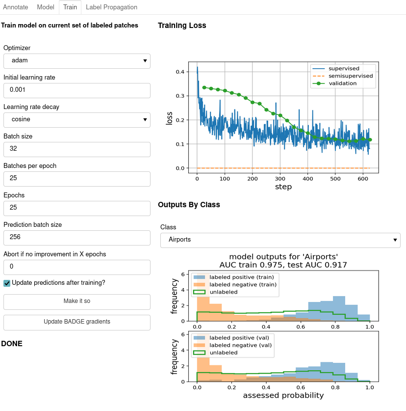

# Active Learning GUI

Here's the intended workflow:

* Start with a list of paths to all your image files
* Train a feature extractor for the images (as a `keras` model), or generate pre-extracted features (as a `numpy` array) for each image.
  * In the pre-extracted feature case, the rest of the workflow is lightweight enough that I can run it on an old laptop with no GPU
* Use `patchwork.prep_label_dataframe()` to initialize a `pandas` dataframe to store your labels (or start with an existing one). Since your time is precious, a careful representation of the time you spend annotating is the most important resource we'll build. The dataframe will have a few columns:
  * path to the file
  * a Boolean `validation` column (default `False`) that indicates the image should be used for testing any models we build and held out of training
  * a Boolean `exclude` column (default `False`) that records problematic images- record that you've seen it so you can find it again, but remove it from the training set.
  * one column per class that can take values `None` (unlabeled), `0` (doesn't contain class) or `1` (contains class). `patchwork` can handle partially-missing labels.
* Using your features and label dataframe, start a `patchwork.GUI` object.
  * Sample images to label
  * Select a fine-tuning model (maps generic feature tensors to task-specific feature vector) and output model (maps feature vector to probabilities over classes)
  * Train model and evaluate results
  * Lather, rinse, and repeat: use active learning to prioritize which images to label, and add capacity to your fine-tuning model as needed.
* When you've built a useful prototype, access the labels in `GUI.df` or the models in `GUI.models` to connect to the next step in whatever problem you're solving!

                                        
## Interactive Labeling and Fine-Tuning

More details forthcoming. Here are the basic steps to load the GUI inside a Jupyter notebook:

```{python}
import matplotlib.pyplot as plt
import panel as pn
pn.extension()
plt.ioff()

# prepare a DataFrame to hold labels if this is a new project (or
# just load the old DataFrame otherwise)
imfiles = [x.strip() for x in open("allmyfiles.txt").readlines()]                                     
classes = ["cat", "mammal", "dog"]
df = patchwork.prep_label_dataframe(imfiles, classes)

# load a feature extractor
fe = tf.keras.models.load_model("pretrained_feature_extractor.h5")
fe.trainable = False

# pass dataframe and feature extractor to a Patchwork object and
# load the GUI
pw = patchwork.Patchwork(df, feature_extractor=fe, imshape=(256,256), 
                        outfile="saved_labels.csv")
pw.panel()
```

### Label tab
                        


### Model tab


### Train tab


