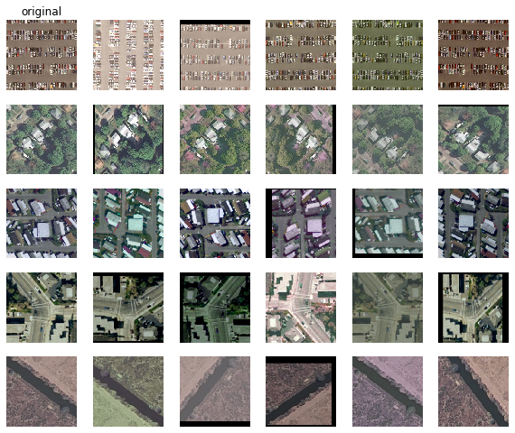

# Input and augmentation parameters

Augmentation is a critical part of effectively using self-supervision for imagery- it's worth the time to experiment with augmentation parameters to find a set that work well for your problem. Once you've got them, you can re-use them in all the `patchwork` tools.

## Input parameters

* `imshape` (H,W) tuple defining an image shape. All images will be resampled to this shape.
* `num_channels` integer; the number of channels per image. If an image has more channels than this (for example, and RGBA image when `num_channels=3`) it will be truncated.
* `norm` value to divide image data by to scale it to the unit interval. This will usually be 255 but may be different for GeoTIFFs, for example.
* `batch_size` integer; batch size for training
* `num_parallel_calls` integer; number of parallel threads to use for loading and augmenting (generally set to number of CPUs)
* `sobel` Boolean; if `True` then each image is averaged across its channels and then Sobel filtered. The 2-channel output of the Sobel filter is padded with a third channel of zeros so that you can use this with standard 3-channel-input convnets.
* `single_channel` Boolean; let `patchwork` know that you expect single-channel input images. If `num_channels > 1` the image will be repeated across channels (again, for example, for using single-channel images with 3-channel-input convnets)

## Augmentation parameters

You can pass `False` to the `augment` parameter to disable augmentation, `True` to use defaults, or a dictionary containing any of the following (with the rest disabled). Operations are applied in the order given here:

DEFAULT_AUGMENT_PARAMS = {
    "gaussian_blur":0.2,
    "drop_color":0.2,
    "gaussian_noise":0.2,
    "sobel_prob":0.1,
    "brightness_delta":0.2,
    "contrast_delta":0.1,
    "saturation_delta":0.1,
    "hue_delta":0.05,
    "flip_left_right":True,
    "flip_up_down":True,
    "rot90":True,
    "zoom_scale":0.2,
    "mask":0.2
}


* `gaussian_blur` (default `0.2`) with the specified probability, smooth the image by convolving with a 7x7 Gaussian kernel
* `gaussian_noise` (default `0.2`) with the specified probability, add normally-distributed white noise to the image with standard deviation 0.1.
* `brightness_delta` (default `0.2`) shift the image's brightness by a value randomly chosen from this interval
* `contrast_delta` (default `0.1`) shift the image's contrast by a value randomly chosen from this interval
* `saturation_delta` (default `0.1`) shift the image's saturation by a value randomly chosen from this interval
* `hue_delta` (default `0.05`) shift the image's hue by a value randomly chosen from this interval
* `flip_left_right` (default `True`) if `True`, flip the image left-to-right with 50% probability
* `flip_up_down` (default `True`) if `True`, flip the image top-to-bottom with 50% probability
* `rot90` (default `True`) if `True`, rotate the image by 0, 90, 180, or 270 degrees with equal probability
* `drop_color` (default `0.2`) with the specified probability, drop color information by replacing every channel with its pixelwise average
* `sobel_prob` (default `0.1`) with the specified probability, use a Sobel filter to trace the edges of the image and return the average of the two outputs 
* `zoom_scale` (default `0.2`) add a random pad to each side of the image, then randomly crop from each side- this parameter sets the scale for both (with `1` being the scale of the image).
* `mask` (default `0.2`) with the specified probability, randomly mask out a rectangle from the image

Use `patchwork.viz.augplot()` to experiment with augmentation:


```{python}
aug = {"brightness_delta":0.2, "contrast_delta":0.4, "hue_delta":0.1,
        "gaussian_blur":0.25,  "drop_color":0.2, "gaussian_noise":0.2,
        "sobel_prob":0.1, "saturation_delta":0.1, "flip_left_right":True,
        "flip_up_down":True, "rot90":True, "zoom_scale":0.4, "mask":0.25}
# imfiles is a list of paths to image files
pw.viz.augplot(imfiles, aug)
```
