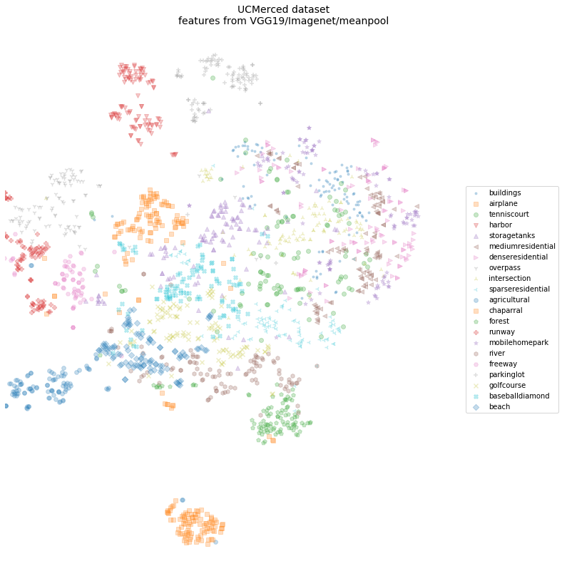
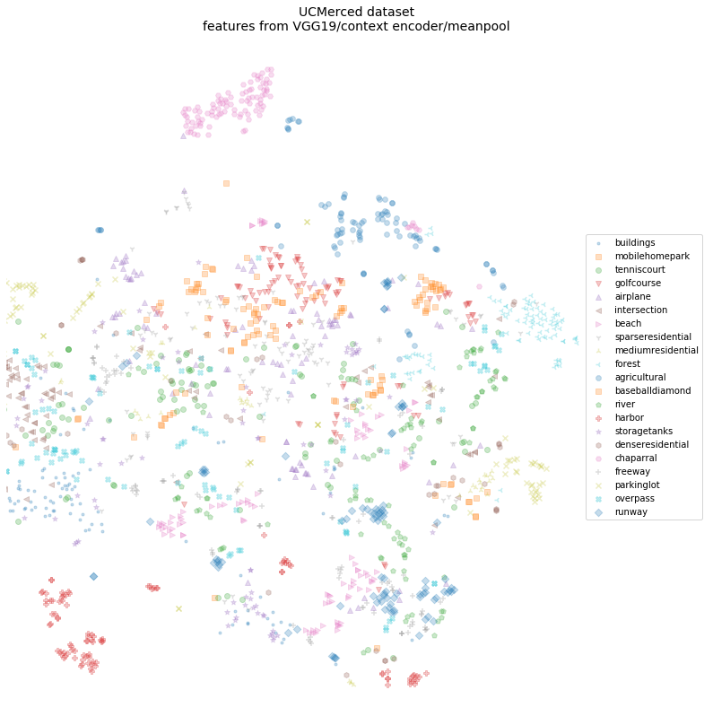
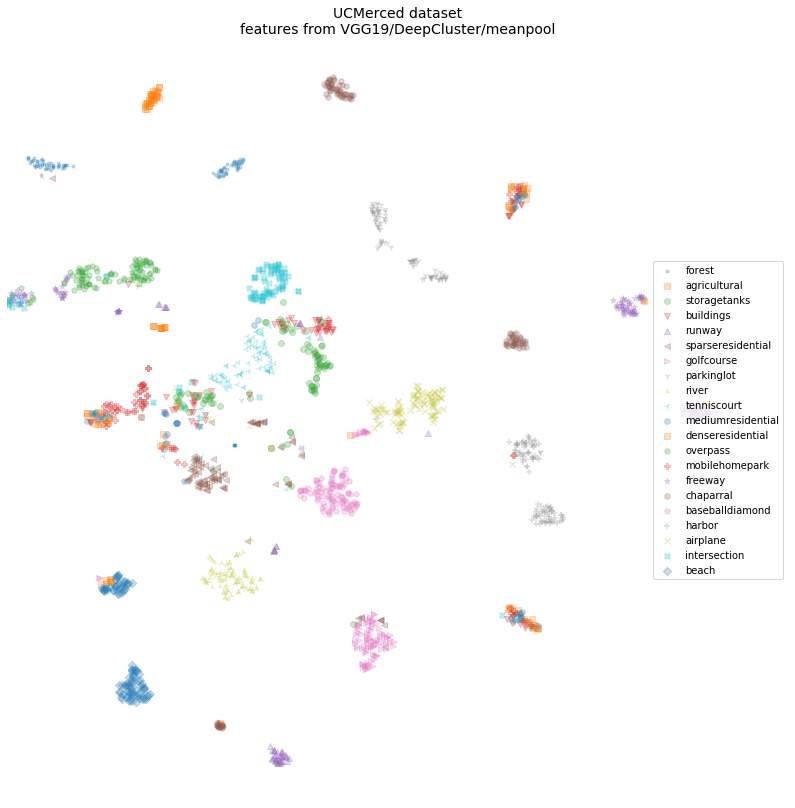
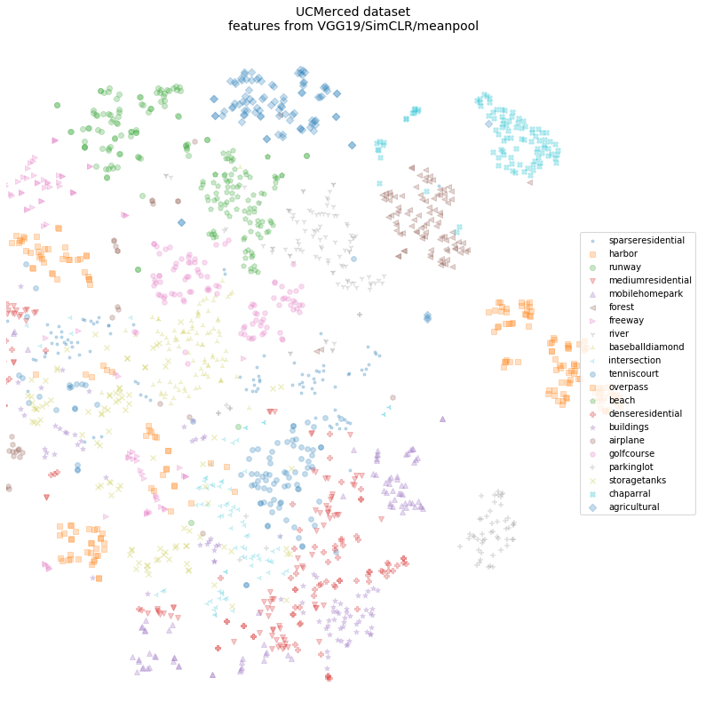

# Feature Extractor tests on the UCMerced dataset

## Baseline: VGG19 pretrained on ImageNet

## VGG19 trained with Context Encoder

## VGG19 trained with DeepCluster

## VGG19 trained with SimCLR

